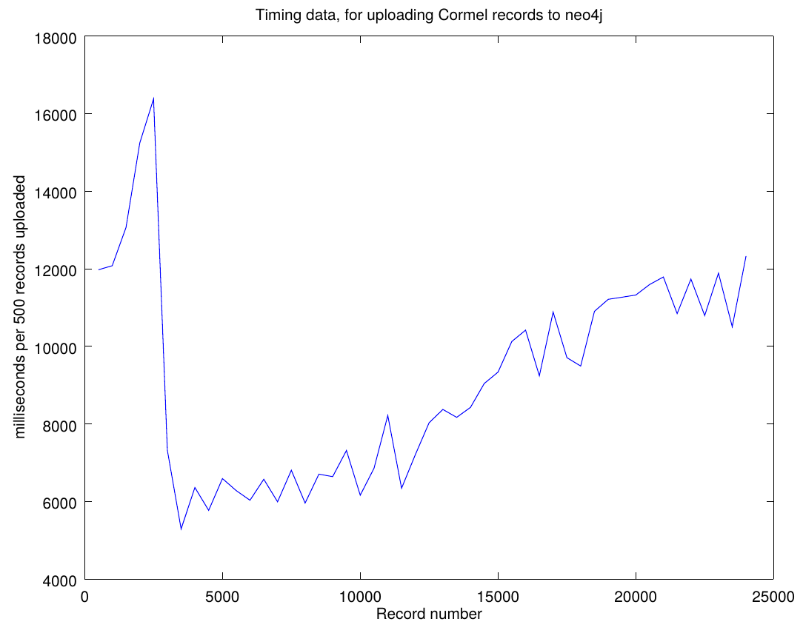
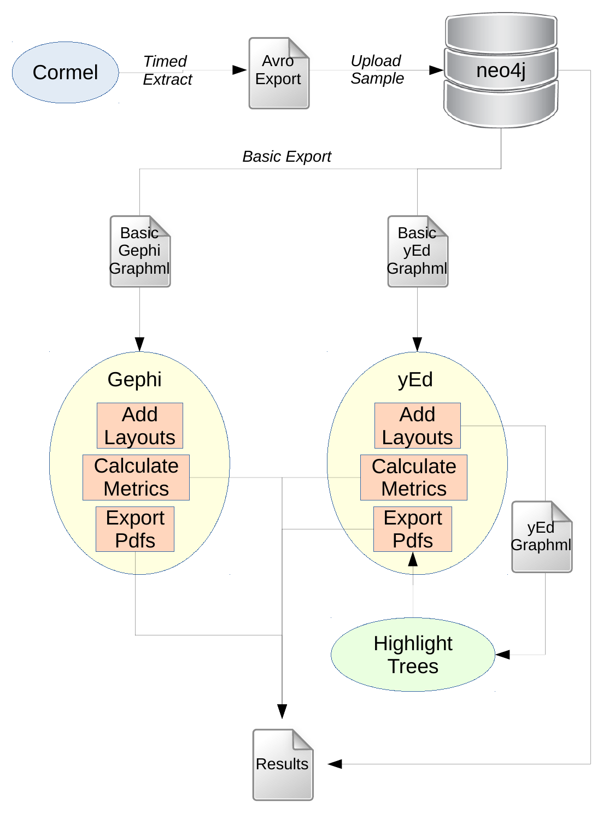

# avro2neo: Loading avro-format transaction trees into neo4j and hence into other tools

## Introduction

CorMel data comprises *segments* that are conceptually nodes in a graph. This
is not surprising, since the CorMel data structures represent transaction
*tree*s.  Representing and analysing them as graphs in a graph database such as
Neo4j offers many opportunities to gain insight into transaction trees, both
individually and as groups sharing properties such as whether the transaction
tree completed successfully. This type of analysis can be done in the graph
database, in applications downstream for the database, or in both.

However, a significant amount of processing is needed to support this analysis,
and this processing can be arranged in a pipeline, as described in more detail
below.

## The processing pipeline

### CorMel format to Avro

The CorMel system takes data from the logs and generates the transaction trees.
This data is then serialised in [Avro](https://avro.apache.org/) format and
stored efficiently in (binary) data files. A single example file was provided
for development purposes and placed in the `avro2neo/input` directory. In Avro
format it occupies 13.9MB and contains 24,499 transaction tree records, as
counted by the [avrocount](https://github.com/jwoschitz/avrocount) command-line
tool:

    java -jar ~/tools/avro/avrocount-0.3.0.jar\
      input/par_U170504_010000_S170504_005800_D60_lgcaa101_20205_0000.gz.avro\
      2> /dev/null

### CorMel Avro format to CorMel JSON format

The Avro format, being binary, is not suitable for inspecting the data.
However, it can be converted easily to JSON format. First, we use the
[avro-tools](https://avro.apache.org/) tool to derive the CorMel Avro schema
`cormel.avsc`:

    java -jar ~/tools/avro/avro-tools-1.8.2.jar getschema\
      input/par_U170504_010000_S170504_005800_D60_lgcaa101_20205_0000.gz.avro\
      > cormel.avsc
 
We can now use [avro-tools](https://avro.apache.org/) to generate the JSON format,
using the `--pretty` option, otherwise the generated JSON lines are extremely long
and hard to read:

    java -jar ~/tools/avro/avro-tools-1.8.2.jar tojson --pretty\
      input/par_U170504_010000_S170504_005800_D60_lgcaa101_20205_0000.gz.avro\
      > input/converted.json

For reference, the resulting `input/converted.json` occupies 395.2MB and has
14,470,577 lines of text.

Once the data is in CorMel Avro format, it is possible to investigate it and
generate subsets.

One investigation concerned whether the `DcxID` field in each `Usegment` is
sufficient to identify transaction trees uniquely. The following command
generated a count of DcxId:

    grep '^  "DcxId" :' input/converted.json | sort | uniq | wc -l

which had fewer unique values (19,815) than there were transaction trees
(24,499).  Further inspection indicated that the combination of `DcxId` and
`TreeId` appears to be unique to each transaction tree.

This analysis proved to be useful during development when it was found that
some records were not being uploaded to neo4j. By identifying an example `DcxId
= "08044X4RIR6H1CW6S739ZB#T91"` that was associated with 3 transaction trees,
it was possible to check that the revised version was loading all the
transactions, as required. First, we used [jq](https://stedolan.github.io/jq/)
to extract the 3 transaction tree records into a smaller CorMel JSON file,
`input/filtered.json`:

    jq '. | select(.DcxId | contains("08044X4RIR6H1CW6S739ZB#T91"))?' <\
      input/converted.json > input/filtered.json

The [avro-tools](https://avro.apache.org/) tool was then used to convert
`input/filtered.json` file back to Avro format as `input/filtered.avro`, for a
test upload to neo4j.

    java -jar ~/tools/avro/avro-tools-1.8.2.jar fromjson --schema-file\
      cormel.avsc input/filtered.json > input/filtered.avro

In general, however, it is more convenient to work with the (space-efficient)
Avro format directly, especially since [avro-tools](https://avro.apache.org/)
provides bindings for common languages (such as Java and python) to perform
operations (notably serialising and deserialising) to/from Avro data.

### CorMel Avro format to neo4j

[Neo4j](https://neo4j.com/) claims to be the world's leading graph database
platform. It is relatively mature and so offers many tools, particularly in its
[APOC](https://guides.neo4j.com/apoc) extension suite, for graph data analysis
and other advanced operations. Thus it was the obvious graph platform choice.

#### Parsing and mapping from Avro to Neo4j

To upload the data into Neo4j, it is necessary to parse the CorMel data
hierarchy for each transaction tree, and to map each entity into a Neo4j node,
with the edges in the transaction tree being mapped to Neo4j relationships. The
data fields in each CorMel segment are mapped to properties in the associated
Neo4j node.  The node types (`A`, `E`, `H`, `T` and `U`) become Neo4j node
*labels*, and are also added as an extra node property for convenience when
creating queries.

#### Uniqueness constraints
As with any database, it is necessary to define constraints so that duplicate
nodes and relationships are not generated when parsing the transaction trees. For the
legacy indexes in Neo4j 1.x, it was the developer's responsibility to write the
business logic to enforce the constraints to prevent entity duplication.  Since
Neo4j version 2.0, database-level index operations have become available and
much of this logic can be defined declaratively, at the database level, as
would be common in RDBMS. For Neo4j Enterprise customers, uniqueness
constraints can be defined in terms of a combination of property fields, but
each constraint in Neo4j Community Edition is limited to a single property field. In
RDBMS terms, the distinction is between *simple* and *compound* indexes. As a
workaround, we derived a key based on a concatenation of the properties in each
node, stored it in the node as an additional property, and defined the
uniqueness constraint in terms of this derived key.

This workaround achieves the objective of guaranteeing uniqueness, but at the
cost of doubling the space requirement for each node.

#### Architecture and performance

Initially, Neo4j was deployed as a service running in a docker container on the
development laptop. This worked well, until we needed to deploy the latest
version of APOC, and could not find a suitable container definition. We then
switched to a local (in the sense of being installed into `~/tools`)
installation of the Neo4j service.

The upload application is written in Java and interacts with the Neo4j server
by issuing parametrised cypher commands via the the Java database driver over
Neo4j's `Bolt` binary protocol. Generally, the parameters define the node
properties (key-value pairs) containing the data that needs to be uploaded from
the CorMel segments comprising the transaction tree. 

The CorMel upload runs in its own JVM, outside the JVM used by Neo4j, but
sharing resources such as the laptop's CPU, memory and disk. Therefore
efficient use of these resources is a priority.

Initial upload runs had poor performance. Switching to a more powerful laptop
(with a Xeon server-class processor and 64GB of memory) brought little
improvement.  By instrumenting the code, we discovered that performance dropped
as more data was uploaded: transaction tree load times started at about 14
seconds and steadily increased as more transaction trees were added to the
database. Thus a full load (of approximately 25K transaction trees) would take
days to complete.  CPU activity was very high so the laptop fan needed to work
hard to keep the laptop cool. Thus we stopped the uploads as soon as it became
apparent they were making slow progress.

Further analysis indicated that initial versions of the upload application did
not rebuild the Neo4j indexes after refreshing the database and so were unable
to benefit from these indexes when enforcing the constraints, resulting in the
graph database equivalent of "full table scans".  When this problem was fixed,
the overall run time dropped to less than 7 minutes for the full set of
transaction trees.

Resource usage remained quite high, so more flexible transaction handling was
introduced.  Initial versions opened up a single session for each file upload,
which had the effect of beginning a transaction which was closed when the
session closed after all the CorMel data in that file had been processed.
However, Neo4j allows developers to create transactions explicitly. It is even
possible, though discouraged in the documentation, to insert
`beginTransaction()` and corresponding `success()` (commit) and `close()`
method calls in the code. This fine degree of transaction control was added,
shaving about 20 seconds off the overall run time, and reducing the resource
usage (as seen from the output of the `top` command).

Timing data for each run can be found in `output/timings/yyyymmdd_HHMMSS.txt`,
where `yyyymmdd_HHMMSS` represents a typical timestamp for when the run
started. Timing data can be plotted using the `octave` function
`script/plotTimings.m` as follows:

    echo "cd script; plotTimings(\"../output/timings/20170802_153002.txt\")"\
      | octave -qf 2> /dev/null

where the resulting plot can be found in `output/timings/20170802_153002.pdf`
which can be viewed in Figure 1 below. For convenience, the PDF can be cropped
as follows:

    pdfcrop --margins 5 output/timings/20170802_153002.pdf\
      graphics/20170802_153002-CROPPED.pdf

and converted to PNG (for insertion into MS documents on MS Windows; PDF gives better results
(because it is a vector format) in both LaTeX and LibreOffice documents and MS documents on MacOS) using 

    pdftoppm -f 1 -singlefile -png graphics/20170802_153002-CROPPED.pdf\
      graphics/20170802_153002-CROPPED

The resulting plot can be viewed in Figure 1 below.

{height=9cm}

For convenience, it is possible to recreate this and other PNG files using

    script/pdf2png.sh 1024

where `1024` in this example represents the desired resolution, in pixels, of
the longest side of the image. Note that `script/pdf2png.sh` is designed not to
overwrite existing PNG files in the set it generates.

#### The upload application

The upload application has many transitive dependencies and so was built using
maven.  It is run as a command line application with two arguments: the
location of the Avro input file, and a string (which defaults to `partial`)
indicating whether this is a full (all records) or partial (just a subset of
the records) upload.  If it is a partial load,

* the time taken to load each transaction tree is reported on `stdout` and sent to a timings file.
* there is just one `transaction` per `session`

For a `full` upload, progress reporting frequency is reduced (once every 500
transaction tree uploads, say) and there are multiple `transaction`s per
`session` (a transaction is committed, closed and a new one opened after 2500
transactions trees have been uploaded, say).
  
Upload runs have the following form:

    script/uploadCorMelAvroToNeo4j.sh\
      input/par_U170504_010000_S170504_005800_D60_lgcaa101_20205_0000.gz.avro\
      full

or

    script/uploadCorMelAvroToNeo4j.sh input/sample.avro partial

This bash script stops the Neo4j database if it is running, resets the database
and restarts it before invoking the Java application with the appropriate
arguments. The Java application does the work.

#### Analysis options in Neo4j

Neo4j, via its APOC extension package, offers the following graph analysis algorithms:

* Closeness centrality: `apoc.algo.closeness(...)`
* Betweenness Centrality: `apoc.algo.betweenness(...)`
* PageRank: `apoc.algo.pageRankWithConfig(...)` and `apoc.algo.pageRank(...)`

Because of the structure of the graph, the results are not particularly interesting.
However, if the transaction trees were classified into "successful" and "failed"
categories, it might be possible to use such per-node scores to suggest interesting
discriminating features.

#### Visualisation and analysis options

Neo4j provides a basic visualisation using a force-directed layout. While this is
adequate for development and testing purposes, it is difficult to see the
underlying "forest of trees" structure of the graph.

[yEd](https://www.yworks.com/products/yed) and [Gephi](https://gephi.org) are
attractive tools for visualising graphs. The former is more of a business
diagram drawing tool with particularly good support for graph-based diagrams.
The latter is intended more for visualising graphs in their own right; it also
has extensive graph metric calculations.

There are potentially ways to stream Neo4j data to Gephi for plotting, but no
equivalent support is offered for yEd. Therefore, the approach that offers the
most flexibility is to serialise Neo4j data to a common format. In that regard,
graphml is the most attractive format, as

1. It can be uploaded into both yEd and Gephi
2. An APOC procedure exists to export Neo4j data in graphml format.

The main downside is that graphml is a verbose XML-based format and hence
results in relatively large files.

#### Exporting Node4j data to graphml

The following command can be used to export the Neo4j database in graphml
format:

    script/exportNeo4jToGraphml.sh script/exportNeo4jToGraphml.cql\
      script/full.cql output/graphml/full.graphml

The problem with this procedure is that it does not scale well with the size of
the database and has never run to completion in any test so far. However, in
that regard, it would be impossible to interpret a visualisation of 24,499
transaction trees, so it makes sense to derive a random sample of such
transaction trees, and to export this to graphml instead.

[This stackexchange question](https://stackoverflow.com/a/45469605/1988855)
indicates two ways to extract a random subforest of the full forest. Neo4j JVM
memory management problems arose with both, even with the JVM memory limit
setting in `neo4j.conf` increased to 4GB (from 512MB). A common error message
was `GC limit exceeded` where `GC` is the JVM's Garbage Control process. Even
when just the queries run, without attempting to serialise the query results to
graphml, the problem persists. Therefore, an alternative approach was needed.

There is a tool ([`ratatool`](https://github.com/spotify/ratatool)) that
extracts a sample of records from Avro files. A bash script was written to
provide a more convenient interface. An example invocation of this bash script
is:

    script/randomSampleFromAvro.sh -i\
      input/par_U170504_010000_S170504_005800_D60_lgcaa101_20205_0000.gz.avro\
      -o input/sample20.avro -n 20

This sample data can be uploaded, replacing any existing CorMel data in the
Neo4j database, using

    script/uploadCorMelAvroToNeo4j.sh input/sample20.avro partial

This data can then be exported as graphml using either

    script/exportNeo4jToGraphml.sh script/exportNeo4jToGraphml.cql\
      script/full.cql output/graphml/sample20.graphml

or

    script/exportNeo4jToGraphml.sh script/exportNeo4jToGraphml.cql\
      script/fullAPOC.cql output/graphml/sample20.graphml

#### Importing the graphml export file into Gephi and yEd

Both yEd and Gephi import the exported graphml files without complaint.
However, there is some data loss. This is because the APOC graphml export
function does not not "register" graphml `<key ..>` elements for each of the
Neo4j node properties stored in graphml `<data ..>` elements. Consequently
these `<data ..>` elements are dropped silently on import. The properties and
their values provide vital context for each node, notably their Neo4j label
(equivalently, their CorMel segment type) among others, so it is necessary to
ensure that this data is protected from deletion on upload.

A python script was written to add the missing elements, and also to add data
that is interpreted by the importing application (yEd or Gephi) to display the
node in colour. This type of additional data is application-specific (different
XML attributes are used for the Neo4j properties in each `<key..>` definition
format, and node colours are specified differently also), so two
variants of extended graphml are needed (one for Gephi, one for yEd).

    script/neo4jGraphmlToOtherGraphml.py output/graphml/sample20.graphml\
      output/graphml/sample20gephi.graphml gephi

and

    script/neo4jGraphmlToOtherGraphml.py output/graphml/sample20.graphml\
      output/graphml/sample20yed.graphml yed

The files relevant to each application can be uploaded without data loss, and
the nodes will be coloured according to their CorMel segment (equivalently,
Neo4j label).

#### Displaying the transaction trees in Gephi and yEd

Several different layouts can be used to display transaction trees in both
Gephi and yEd. Gephi offers a larger choice of options, but in practice, the
`graphviz/dot` layout offers the best way to visualise the transaction trees.

yEd offers fewer layout choices, but arguably more of them are suited to
transaction tree visualisation. In particular, two sets of layouts are most
helpful:

* `hierarchical`
* `series-parallel`

and

* `circular`
* `tree-balloon`

The first two are similar to Gephi's `graphviz/dot` layout, and represent trees
in the traditional fashion, which works well for relatively narrow, deep trees.
The second two work better for broad, shallow trees. In the samples we have
seen, transaction trees can take either "shape".

Even with a sample of just 20 transaction trees, it can be difficult to
interpret the graph visualisations. This is because some transaction nodes are
*degenerate* in the sense that relatively few fields have values assigned to
them. When such transaction nodes are shared between separate transaction
trees, this adds complexity to the graph because the corresponding transaction
trees overlap each other.

Thus there is a visualisation dilemma: visualise single trees (thereby losing
some information and hiding some of the complexity), or visualise the sample of
trees (keeping all the information but making interpretation more difficult).
The latter is more realistic but the resulting "tangle" of transaction trees
looks like overgrown woodland rather than a forestry plantation.

The solution was to show transaction trees in context, but to highlight the
edges belonging to a specified tree. The transaction tree we wish to highlight
is displayed with black edges but the edges of other trees are light grey.

To achieve this type of labeling, it was necessary to enhance the neo4j data
model as it applies to the relationships in the graph. In particular, it was
necessary determine a (combination) of identifiers that is unique per
transaction tree. Since each tree is *rooted* in a single `U` node, it makes
sense to label the tree according to an identifier based on the fields (Neo4j
properties) in its root `U` node.  While the concatenation of all field values
in that node serves as a possible tree identifier, it is long and cumbersome to
use. A *sufficient subset* comprises the `DcxId` and `TreeId` fields. These
attributes were added to all the edges in the transaction tree, and were
assigned so that every edge "under" the root `U` node has the same values of
`DcxId` and `TreeId` as the root node.

There were some technical issues to overcome, in the sense that yEd tended to
"drop" the value of the `DcxId` field from the edges when exporting the diagram
as graphml.  The `TreeId` field did not have this problem, as it was an
integer. It appeared that yEd might choose to do so because of the presence of
non-alphanumeric characters (such as "$" and "#") in the `DcxId` strings.
Wrapping the `DcxId` values in 'CDATA[...]` protected them from the first stage
of yEd exports, but not from the second. Therefore, it was decided to derive a
numeric *surrogate* key for transaction trees, and to add this field, with the
CorMel-derived `DcxId` and `TreeId` fields in the transaction tree edges.

A further technical issue was caused by the fact that some transaction tree
edges, and not just transaction nodes, are "shared" between transaction trees.
Such shared edges occur when a shared transaction node is connected to another
shared transaction node in the same transaction tree.  While shared edges share
the same start and end nodes, they have different property values and hence
neo4j sees them as different edges. This complication has two effects:

1. Gephi ignores the edge property values and focuses just on the start and end
nodes of each edge. Thus it sees "shared" edges as repeated edges, and displays
a single edge instead whose weight (hence line width) is the sum of the weights
of the individual edges sharing those start and end nodes. yEd notices the
differing property values between the "shared" edges and so does not do
anything special with such edges. It was decided that Gephi's interpretation
was unwelcome, because it drew excessive attention to such shared edges.
Consequently, a processing stage was added while populating the neo4j database
to create a table whose columns were a) the `fromNodeId`, b) the `toNodeId` and
c), the corresponding list of `edgeId`s. In most cases, that list contained a
single element, but where "shared" edges occurred, two or more `edgeId`s could
be found. This was added as a further neo4j edge property (`Rel_TreeList`)
which is exported to graphml as `edgeTreeList`. From the `edgeTreeList`
property for each edge, a derived `card` (short for "cardinality") is computed
from the number of neo4j relationships sharing that edge.  The exporter for
Gephi was modified so that the edge weight was assigned `1/card` instead of `1`
as before.

2. A race condition is introduced by the presence of potentially contrasting
line colours for the "same" edge. That is, if the highlighted transaction tree
"shares" an edge with one or more standard transaction trees, the colour of
that edge depends on which tree has the highest surrogate key value, and not on
whether the transaction tree is highlighted or not. The solution was not to
change the colour, but to change the line width of all non-selected transaction
tree edges in that set of shared edges, provided the selected tree is one of them.
Since the line width was set to zero, it becomes invisible, and so cannot
overwrite the edge if it was already drawn as a highlighted edge.

#### Summary of the graphml processing in Gephi and yEd

When the `output/graphml/sample20gephi.graphml` or
`output/graphml/sample20gephi.graphml` has been generated as described earlier,
it is possible to upload into the relevant application (Gephi or yEd,
respectively).  After the layout algorithm has been applied, it is the possible
to export the resulting graph (with position information) to files such as:

    output/graphml/sample20gephi_dot.graphml
    output/graphml/sample20yed_circular.graphml
    output/graphml/sample20yed_hierarchical.graphml
    output/graphml/sample20yed_seriesParallel.graphml
    output/graphml/sample20yed_treeBalloon.graphml

Such files show all transaction trees together. Some trees overlap, making
interpretation difficult, as described earlier.

To highlight each of the transaction trees, for each of the yEd-based layouts
("circular", "hierarchical", "series-parallel" and "tree-balloon"), the
following script is convenient:

    script/highlightTypesRangeOfTrees.sh 20

where it has been assumed that the input file names follow the pattern above.
The resulting graphml files take the form:

    output/graphml/sample${numTrees}${app}_${layout}_hl${i}.graphml

with examples such as

    output/graphml/sample20yed_circular_hl01.graphml
    ...
    output/graphml/sample20yed_circular_hl20.graphml
    output/graphml/sample20yed_hierarchical_hl01.graphml
    ...
    output/graphml/sample20yed_hierarchical_hl20.graphml
    output/graphml/sample20yed_seriesParallel_hl01.graphml
    ...
    output/graphml/sample20yed_seriesParallel_hl20.graphml
    output/graphml/sample20yed_treeBalloon_hl01.graphml
    ...
    output/graphml/sample20yed_treeBalloon_hl20.graphml
 
For publication purposes, it is necessary to convert the 20\*4 = 80 such files
from graphml to pdf.  This is achieved by opening each file in yEd and
exporting it (in PDF format) to a file with the same name but a pdf extension.
Unfortunately this is a manual operation: yEd is a freeware graph viewer and
its parent company (yWorks GmBH) sells a suite of software that can be used to
automate such processes.

For including the PDF graph "pictures", it is more convenient to trim
unnecessary whitespace that had been added by yEd so that the graphs fit in an
A4 page.This can be achieved using

    script/cropPdfs.sh 20

which defaults to PDF filenames with the following pattern:

    output/graphml/sample${numTrees}${app}_${layout}_hl${i}.graphml

Optionally, it is possible to combine these PDF files by yEd layout type, using

    script/assemblePdfs.sh

giving

    output/pdf/sample20yed_circular_hl.pdf
    output/pdf/sample20yed_hierarchical_hl.pdf
    output/pdf/sample20yed_seriesParallel_hl.pdf
    output/pdf/sample20yed_treeBalloon_hl.pdf

It is then possible to open such files in PDF viewer and compare different
transaction trees in a more convenient fashion, e.g., by viewing them as "animations"
by advancing the page: human visual perception is relatively good at noticing
differences between successive "frames" (graph plots).

## Summary and Next Steps

Figure 2 below is a summary of the processing pipeline described above.

{height=9cm}

